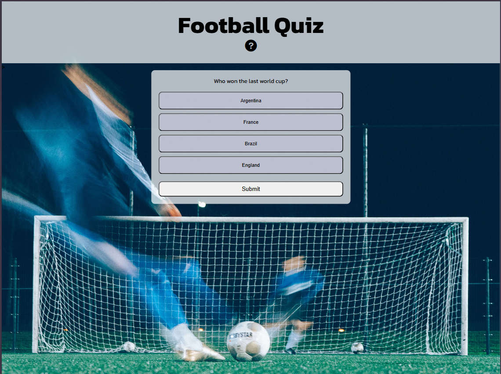

# Football Quiz

This quiz is for football fans to test their knowledge. The aim is to get as high of a score as possible from the array of questions provided, when the quiz is complete an alert will appear to display the result and when you click 'OK' the page refreshes to reset.

This quiz hopes to give users an engaging and enjoyable experience through testing their knowledge and offering an easy to use knowledge checker with an intuitive design.

# Features

- ### Relevant background
    - The background image will be a familiar site to football fans as it shows goalposts with a footballer shooting. It has mostly dark colours which helps create contrast with the semi-transparent white boxes.

- ### Header
    - The header is simple but big and clear with the words 'Football Quiz and an icon of a question mark below it. 

- ### Favicon
    - A favicon was created using [Favicon.io](https://favicon.io/).
    
    

- ### Fully responsive
    - No media queries were needed as the design adapts well to tablet and mobile screens.

    

    

- ### Feedback
    - When an option is selected it will turn green to show feedback.

    

    - Another form of feedback is the results alert that appears when the quiz is complete. 

    

# Testing

- All questions were tested to make sure the correct answer is being picked up by the code.
- All HTML was tested in [W3C validator](https://validator.w3.org/) with one small error. A div ended to be closed.
- All CSS was tested in [W3C validator](https://jigsaw.w3.org/css-validator/) one error. A grid-template-column was removed.
- All Javascript was tested in [JSHint](https://jshint.com/). A few warning messages of 'arrow function syntax (=>)' is only available in ES6,

# Deployment

1. Go to the Settings tab of your GitHub repo.
2. On the left-hand sidebar, in the Code and automation section, select Pages.
3. Make sure:
    - Source is set to 'Deploy from Branch'.
    - Main branch is selected.
    - Folder is set to / (root).
4. Under Branch, click Save.
5. Go back to the Code tab. Wait a few minutes for the build to finish and refresh your repo.
6. On the right-hand side, in the Environments section, click on 'github-pages'.
7. Click View deployment to see the live site. 

Deployment steps from the [Code Institute](https://codeinstitute.net/)

Live link for this project can be found [here](https://johnnysavageni.github.io/football_quiz//)

# Credits

- Background image came from [Unsplash](https://unsplash.com/)
- Icons from [Font Awesome](https://fontawesome.com/)
- Fonts from [Google Fonts](https://fonts.google.com/)
- Favicon was generated using [favicon](https://favicon.io/)
- Starting idea for the project came from this [YouTube video](https://www.youtube.com/watch?v=CqddbIrEM5I)